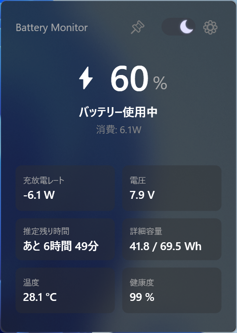
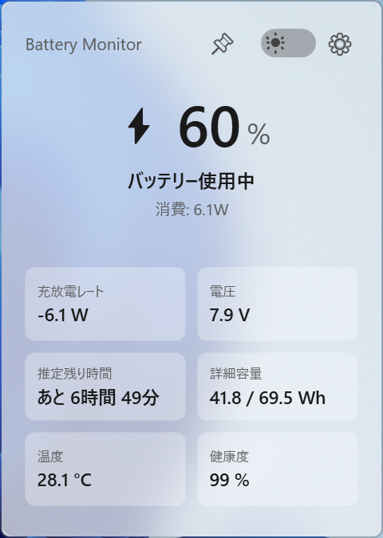
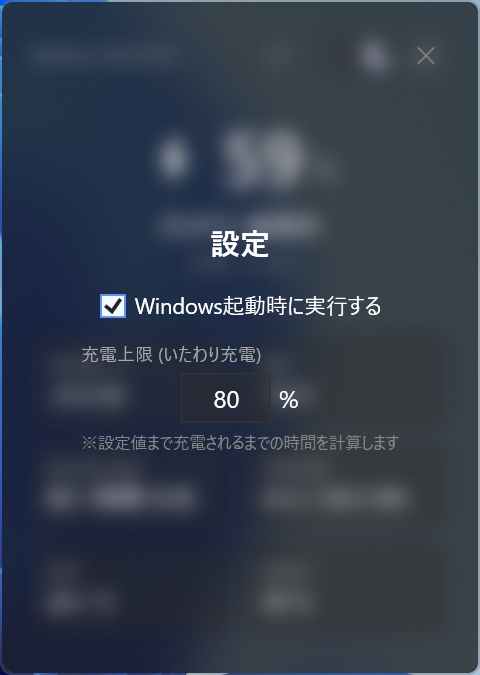

# BatteryMonitor

BatteryMonitor は、Windows のシステムトレイに常駐して、必要なときだけバッテリー情報をすばやく確認できる軽量モニターアプリです。

普段は画面を占有せず、トレイアイコンやショートカットからポップアップで情報を表示します。

## 使う人向け

### このアプリでできること

BatteryMonitor は、バッテリー残量や充放電レートをシステムトレイからすばやく確認するためのアプリです。ポップアップでは、残量、充放電レート、電圧、推定残り時間、詳細容量、温度、健康度などをまとめて確認できます。テーマ切り替え、ピン留め表示、Windows 起動時の自動実行、充電上限の設定にも対応しています。

### スクリーンショット

ダークモードの表示例です。



ライトモードでは、同じ情報を明るい配色で確認できます。



設定画面では、自動起動や充電上限を変更できます。



### 使い方

#### 起動

アプリを起動すると、通常のウィンドウは開かず、そのままシステムトレイに常駐します。普段は画面を占有せず、必要なときだけポップアップで情報を確認する使い方を想定しています。

#### ポップアップ表示

トレイアイコンにカーソルを合わせると、ポップアップが表示されます。また、`右Shift` をすばやく 2 回押して表示することもできます。右Shift での表示は、トレイにカーソルがない状態でもすぐに呼び出せるショートカットです。

#### ホバー表示とスティッキー表示

ホバーで表示したポップアップは、カーソルが離れると自動で閉じます。一方で、クリックやショートカットで明示的に表示した場合は、内容を確認したり操作したりしやすい表示モードになります。必要であれば、そのまま固定表示に切り替えることもできます。

#### ピン留め

ポップアップ右上のピンアイコンで固定表示を切り替えられます。ピン留め中はポップアップが自動で閉じないため、情報を見続けたいときや設定を調整したいときに便利です。

#### テーマ切り替え

ポップアップ右上のトグルで、ライトモードとダークモードを切り替えられます。見やすさや好みに合わせてその場で変更できます。

#### 設定

設定ボタンからは、Windows 起動時に自動実行するかどうかと、充電上限の値を変更できます。

#### ポップアップ位置

ポップアップはドラッグで移動できます。移動した位置は保存され、次回以降も同じ場所に表示されます。

#### 終了

終了したいときは、トレイアイコンを右クリックして終了メニューを開きます。

### 補足

初回ポップアップ後は、WPF の描画リソース確保によりメモリ使用量が増えることがあります。また、常駐時の負荷を減らすため、更新頻度や取得項目は用途に応じて最適化されています。トレイアイコンはバッテリー残量と充電状態に応じて切り替わります。

## 開発者向け

### 技術スタック

- .NET 8
- WPF
- `Hardcodet.NotifyIcon.Wpf`
- `System.Management`

### 構成

このアプリは「トレイ常駐」「定期更新」「必要なときだけポップアップ表示」という構成です。起動すると [App.xaml.cs](./App.xaml.cs) がアプリ全体を初期化し、トレイアイコン、ショートカット、更新タイマーを立ち上げます。表示用の状態は [ViewModels/BatteryViewModel.cs](./ViewModels/BatteryViewModel.cs) に集約されていて、バッテリー情報の取得結果を UI 用の文字列やトレイアイコン状態に変換します。

実際のバッテリー情報は [Services/BatteryService.cs](./Services/BatteryService.cs) が WMI から取得します。ここでは毎回必要な項目と、キャッシュしてよい項目を分けています。トレイポップアップの表示、ホバー表示、右Shift 2回ショートカット、ピン留め、外部クリック時のクローズ制御は [Services/TrayIconController.cs](./Services/TrayIconController.cs) が担います。

UI は [Views/PopupView.xaml](./Views/PopupView.xaml) と [Views/PopupView.xaml.cs](./Views/PopupView.xaml.cs) にまとまっています。ここでは見た目の定義に加えて、テーマ切り替え、背景効果、ドラッグ移動、位置保存、閉じアニメーションなどを扱っています。テーマ色そのものは [Views/Themes/DarkTheme.xaml](./Views/Themes/DarkTheme.xaml) と [Views/Themes/LightTheme.xaml](./Views/Themes/LightTheme.xaml) に分かれています。

トレイアイコンは実行時描画ではなく、[Images/TrayIconsIco](./Images/TrayIconsIco) にある事前生成済み `.ico` を読み込みます。どのアイコンを使うかの判定とキャッシュは [Helpers/SvgIconGenerator.cs](./Helpers/SvgIconGenerator.cs) が担当します。名前は過去の実装由来ですが、現在は SVG 生成ではなくアイコン読み込みの役割です。

設定の保存先やバッテリー情報の受け渡しは [Models/AppSettings.cs](./Models/AppSettings.cs) と [Models/BatteryInfo.cs](./Models/BatteryInfo.cs) にあります。Windows 起動時の自動実行は [Services/StartupManager.cs](./Services/StartupManager.cs)、テーマ状態の切り替えは [Services/ThemeManager.cs](./Services/ThemeManager.cs)、背景アクリル効果は [Helpers/WindowBackdrop.cs](./Helpers/WindowBackdrop.cs) が担当します。

### WMI について

バッテリー情報の取得には、Windows Management Instrumentation (WMI) を使っています。実装は [Services/BatteryService.cs](./Services/BatteryService.cs) にまとまっており、バッテリー残量や電圧、充放電レート、設計容量、満充電容量、サイクル回数、温度などを WMI クラスから読み出します。

現在使っている主な情報源は次のとおりです。

- `BatteryStatus`
  - 充電中かどうか、電圧、残容量、充電レート、放電レート
- `BatteryStaticData`
  - 設計容量
- `BatteryFullChargedCapacity`
  - 満充電容量
- `BatteryCycleCount`
  - サイクル回数
- `MSAcpi_ThermalZoneTemperature`
  - 温度

このアプリでは、WMI 取得をすべて同じ頻度では回していません。残量や充放電レートのように変化を見たい情報は比較的短い間隔で取得し、設計容量、満充電容量、サイクル回数、温度などはキャッシュを使いながら長めの間隔で更新します。これは、常駐アプリとしての CPU 使用率や体感レスポンスを下げるためです。

また、WMI から取った値をそのまま表示するのではなく、[ViewModels/BatteryViewModel.cs](./ViewModels/BatteryViewModel.cs) で UI 用の文字列へ整形しています。推定残り時間、健康度、詳細容量、トレイアイコンの状態などはこの段階で計算されます。

ただし、これらの情報はすべての PC で同じように取得できるわけではありません。温度、サイクル回数、設計容量、満充電容量などは、使用しているノート PC やバッテリー制御の実装によって取得できないことがあります。その場合、このアプリでは該当項目を `--` 表示にします。これはアプリの不具合ではなく、WMI 経由で公開されている情報の差に起因する場合があります。

実際に、Dell 製ノート PC では温度が WMI から取得できず、`--` になることがありました。これは Dell に限った話ではなく、同じメーカー内でも機種ごとに公開される情報が異なる場合があります。標準 WMI で見えない値をメーカー独自の仕組みで参照できる可能性はありますが、このアプリでは現時点で Windows 標準の WMI を優先して利用しています。

### 動作の流れ

アプリ起動後は、まずトレイアイコンとポップアップが初期化されます。その後、非表示時は比較的長い間隔で更新し、ポップアップ表示中だけ短い間隔で更新します。重要な情報である残量や充放電レートは優先的に更新し、それ以外の情報は更新頻度を落として負荷を下げています。

ユーザーがトレイアイコンにホバーするか、`右Shift` を 2 回押すと、ポップアップが表示されます。ポップアップは保存位置に表示され、必要ならその場で移動して位置を保存できます。表示中の閉じ方は、ホバーによる自動非表示、ショートカットによるトグル、ピン留めによる固定表示などで分岐しています。

### なぜ Window ではなく Popup なのか

このアプリは、通常のアプリウィンドウではなく、トレイに寄り添うフローティング UI として設計しています。タスクバーに常駐ウィンドウを出したくなく、必要なときだけ軽く呼び出せる情報パネルにしたかったため、通常の `Window` ではなく `Popup` を採用しています。

`Popup` はこの用途に非常によく合っていますが、そのままでは一般的なウィンドウのように自由移動や位置保存がしにくく、ホバー表示や明示表示、ピン留め、外部クリックでの自然なクローズ、ショートカット表示時の前面化なども素直には扱えません。そのため、このプロジェクトでは `Popup` を単なる補助UIではなく、実質的なフローティングウィンドウとして扱うための制御ロジックを追加しています。

### ウィンドウ移動の実装

ポップアップのドラッグ移動は、単純な WPF 相対座標ではなく、Win32 のカーソル位置を使ったスクリーン座標差分方式で実装しています。実装の中心は [Views/PopupView.xaml.cs](./Views/PopupView.xaml.cs) です。

この方式を採っている理由は、移動中のウィンドウ自身を基準にするとジッターや位置ズレが起きやすいためです。現在は `GetCursorPos` で物理座標を取得し、WPF の論理座標へ変換したうえで `Popup.HorizontalOffset` と `Popup.VerticalOffset` を更新しています。さらに、モニターごとの作業領域を見ながらクランプすることで、画面端でのデッドゾーンや画面外への飛び出しを抑えています。

また、移動後の位置は [Models/AppSettings.cs](./Models/AppSettings.cs) に保存され、次回表示時に復元されます。ポップアップ表示のたびに保存位置を適用するようにしているため、ホバー表示やショートカット表示でも位置がなるべく安定するように調整しています。

### ディレクトリの見方

`Services` はバッテリー取得や表示制御などの動作ロジック、`ViewModels` は表示用データ整形、`Views` はポップアップ UI、`Helpers` は補助処理、`Models` は永続化やデータ受け渡し用の型、`Images` はトレイアイコンなどのアセットを置く場所です。現在は単一機能のアプリとして比較的コンパクトですが、表示制御や更新制御の責務が大きくなってきているため、今後はこの構成をベースに分割を進める余地があります。

### 開発メモ

- メイン画面は廃止済みで、トレイ常駐専用アプリとして動作します。
- トレイアイコンは実行時 SVG 生成ではなく、事前生成した `.ico` を読み込みます。
- バッテリーの重要情報は短めの間隔で、それ以外は長めの間隔で更新します。

### ビルド

Windows 環境で .NET 8 SDK を使ってビルドします。

```bash
dotnet build BatteryMonitor.sln
```

### 注意

- WPF のため、実行とビルドは Windows 環境が前提です。
- `bin/`, `obj/`, `.vs/`, `*.user` などのローカル生成物は Git 管理しません。
